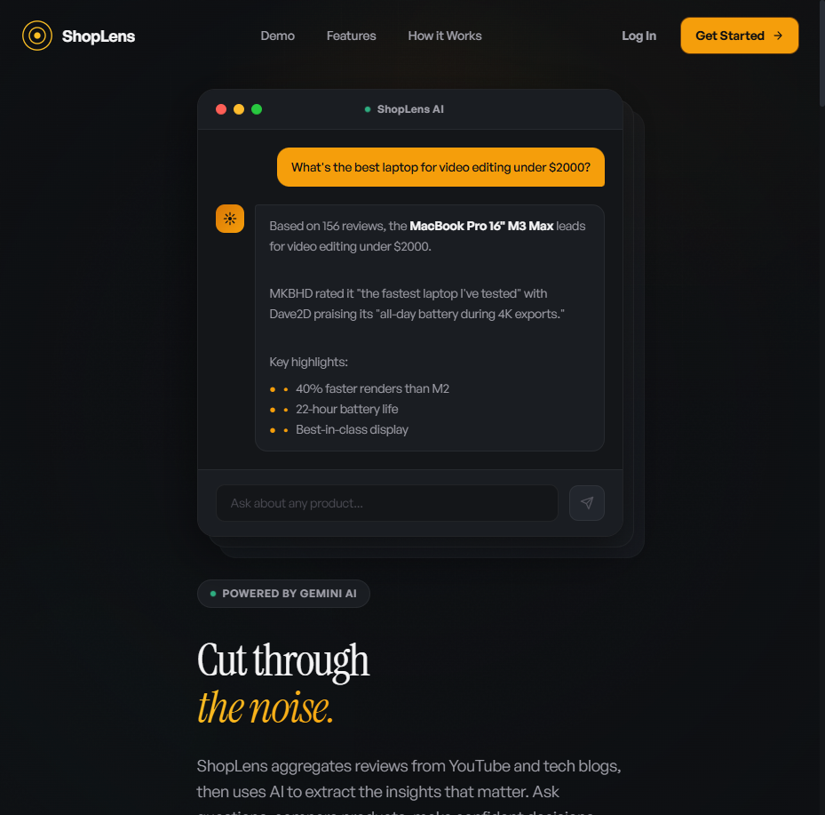
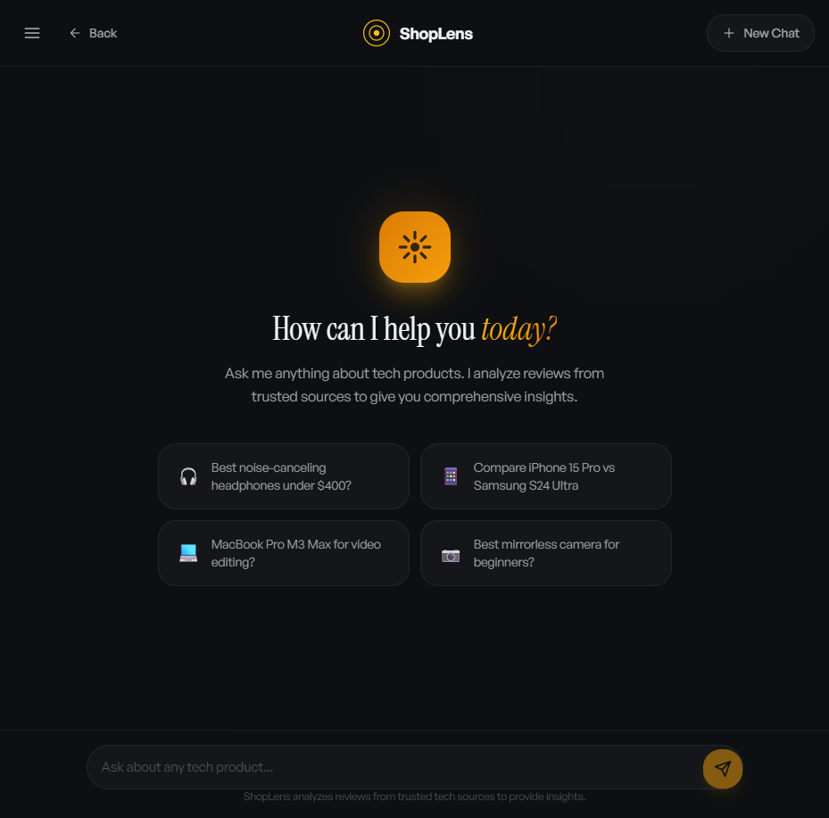

<p align="center">
  
</p>

<h1 align="center">ShopLens</h1>

<p align="center">
  <strong>AI-powered product review intelligence — built on Google Gemini</strong>
</p>

<p align="center">
  ShopLens aggregates tech product reviews from YouTube and blogs, then uses<br/>
  <strong>Gemini's function calling, long-context understanding, and structured output</strong><br/>
  to extract opinions, build consensus, and deliver research-grade insights through natural conversation.
</p>

<p align="center">
  <a href="#how-gemini-powers-shoplens">Gemini Integration</a> &middot;
  <a href="#features">Features</a> &middot;
  <a href="#tech-stack">Tech Stack</a> &middot;
  <a href="#getting-started">Getting Started</a> &middot;
  <a href="#architecture">Architecture</a> &middot;
  <a href="#api-reference">API Reference</a>
</p>

---

## What is ShopLens?

ShopLens is a conversational AI assistant for product research. Instead of reading dozens of reviews across YouTube and tech blogs, you ask ShopLens a question in natural language — and it does the research for you.

Powered by **Google Gemini**, it searches for reviews, scrapes and analyzes content, builds a knowledge base of reviewer opinions, and delivers a synthesized answer with sources — all in a single chat interaction.

<p align="center">
  
</p>

## How Gemini Powers ShopLens

ShopLens is built around **Gemini's unique capabilities** at every stage of the pipeline:

### Function Calling — The Orchestration Engine

Gemini acts as the **autonomous orchestrator** of the entire review pipeline. When a user asks _"Is the Samsung Galaxy S25 worth it?"_, Gemini doesn't just generate text — it reasons about what data it needs and calls 15+ registered functions in sequence:

```
User query → Gemini decides: "I need reviews for this product"
  → calls check_product_cache()
  → calls search_youtube_reviews()
  → calls ingest_youtube_review() × 5
  → calls search_blog_reviews()
  → calls ingest_blog_review() × 3
  → calls get_reviews_summary()
  → calls find_marketplace_listings()
  → synthesizes everything into a final answer
```

Gemini handles multi-turn function calling loops — it inspects each function result, decides what to do next, and keeps going until it has enough information to answer the user's question. No hardcoded pipeline logic; Gemini drives the flow.

### Long-Context Review Analysis

Each scraped review (YouTube transcript or blog post) can be **thousands of tokens**. Gemini's large context window allows ShopLens to send the full review text and extract structured opinions in a single pass — no chunking or summarization shortcuts needed.

For each review, Gemini extracts:
- **Per-aspect opinions** (battery, camera, display, performance, etc.) with sentiment scores
- **Direct quotes** from the reviewer
- **Pros and cons** lists
- **Overall verdict** and rating

### Structured Output — Reliable Data Extraction

Gemini generates structured JSON output that maps directly to the database schema. Every review analysis returns clean, typed data:

```json
{
  "opinions": [
    { "aspect": "battery_life", "sentiment": 0.85, "quote": "easily lasts a full workday" },
    { "aspect": "camera", "sentiment": 0.92, "quote": "best camera in any smartphone" }
  ],
  "pros": ["Excellent battery", "Outstanding camera system"],
  "cons": ["Expensive", "Heavy"],
  "overall_score": 8.5
}
```

### Consensus Generation Across Reviewers

After ingesting multiple reviews, Gemini analyzes all extracted opinions **together** to identify:
- What reviewers **agree on** (consensus strengths and weaknesses)
- What reviewers **disagree on** (controversial aspects)
- Per-reviewer summaries with their unique perspective
- An overall product summary grounded in real reviewer data

### Google Search Grounding — Marketplace Discovery

Gemini's built-in Google Search grounding is used to find real-time marketplace listings (Amazon, eBay, Best Buy) with current pricing — no separate shopping API required.

### Embeddings — Semantic Search

Gemini's `text-embedding-004` model powers the vector search layer, enabling users to search the review knowledge base by meaning (_"comfortable headphones for long flights"_) rather than exact keywords.

---

## Features

**Conversational AI** — Ask anything about tech products in natural language. Gemini uses function calling to orchestrate a multi-step research pipeline behind the scenes.

**Multi-Source Review Aggregation** — Automatically discovers and analyzes reviews from YouTube videos and tech blogs using Firecrawl for URL discovery and content scraping.

**Real-Time Progress Streaming** — SSE-based streaming shows exactly what's happening during research: searching YouTube, analyzing reviews, generating summaries — with live step-by-step progress indicators.

**Product Comparison** — Compare two products side-by-side with Gemini-generated analysis highlighting key differences across every dimension reviewers care about.

**Semantic Search** — Vector-powered similarity search over review content using Gemini embeddings + Qdrant. Find products that match your exact needs by meaning, not just keywords.

**Marketplace Listings** — Gemini Google Search grounding finds where to buy products with links to Amazon, eBay, and other retailers.

**Review Consensus** — Gemini identifies what reviewers agree and disagree on, surfacing the consensus opinions across all analyzed reviews.

**Conversation History** — Full conversation persistence with the ability to continue previous research sessions.

<p align="center">
  
</p>

## Tech Stack

| Layer | Technology |
|-------|-----------|
| **Frontend** | React 19, TypeScript, Tailwind CSS, Framer Motion, React Query v5 |
| **Backend** | FastAPI (Python 3.11), async SQLAlchemy, Pydantic v2 |
| **AI** | Google Gemini (`gemini-3-flash-preview`) via `google-genai` SDK |
| **Embeddings** | Gemini `text-embedding-004` |
| **Database** | PostgreSQL 15 (asyncpg) |
| **Cache** | Redis 7 |
| **Vector DB** | Qdrant (semantic search over review embeddings) |
| **Scraping** | Firecrawl API (URL discovery + content extraction) |
| **Deployment** | Docker Compose, nginx reverse proxy |

## Getting Started

### Prerequisites

- [Docker](https://docs.docker.com/get-docker/) and Docker Compose
- A [Gemini API key](https://aistudio.google.com/app/apikey)
- A [Firecrawl API key](https://firecrawl.dev)

### Quick Start

1. **Clone the repository**

```bash
git clone https://github.com/your-username/ShopLens.git
cd ShopLens
```

2. **Configure environment variables**

```bash
cp .env.example .env
```

Edit `.env` and fill in your API keys:

```env
GEMINI_API_KEY=your-gemini-api-key
FIRECRAWL_API_KEY=your-firecrawl-api-key
SECRET_KEY=your-secret-key    # generate with: openssl rand -hex 32
```

3. **Start the development stack**

```bash
docker-compose -f docker-compose.dev.yml up --build
```

4. **Open the app**

- Frontend: [http://localhost:5173](http://localhost:5173)
- API docs: [http://localhost:8000/docs](http://localhost:8000/docs)

<p align="center">
  
</p>

### Production Deployment

```bash
docker-compose up --build
```

The production stack serves the React frontend via nginx on port 80, with the API proxied through nginx.

### Optional Dev Tools

Start with pgAdmin and Redis Commander for debugging:

```bash
docker-compose -f docker-compose.dev.yml --profile tools up --build
```

## Architecture

```
┌─────────────────────────────────────────────────────────┐
│                     React Frontend                       │
│              (Vite + React 19 + Tailwind)                │
└──────────────────────┬──────────────────────────────────┘
                       │ SSE / REST
                       ▼
┌─────────────────────────────────────────────────────────┐
│                   FastAPI Backend                         │
│                                                          │
│  ┌─────────────┐  ┌──────────────┐  ┌────────────────┐  │
│  │ Chat Service │  │   Gemini     │  │   Function     │  │
│  │ (orchestrator│──│  (chat +     │──│   Registry     │  │
│  │  + SSE)     │  │  fn calling) │  │  (15+ tools)   │  │
│  └─────────────┘  └──────────────┘  └───────┬────────┘  │
│                                              │           │
│  ┌──────────────────────────────────────────┐│           │
│  │           Review Pipeline                ││           │
│  │  cache → search → ingest → summarize     ││           │
│  └──────────────────────────────────────────┘│           │
└──────────┬──────────┬──────────┬─────────────┘           │
           │          │          │                          │
     ┌─────▼───┐ ┌────▼───┐ ┌───▼────┐                    │
     │PostgreSQL│ │ Redis  │ │ Qdrant │                    │
     │  (data)  │ │(cache) │ │(vectors)                    │
     └─────────┘ └────────┘ └────────┘
```

### Gemini Usage Across the Stack

| Capability | Where Used |
|-----------|------------|
| **Function Calling** | Chat orchestration — Gemini decides which pipeline functions to call and in what order |
| **Long-Context Analysis** | Review ingestion — full YouTube transcripts and blog posts analyzed in a single pass |
| **Structured Output** | Opinion extraction — Gemini returns typed JSON (aspects, sentiments, quotes, scores) |
| **Multi-Turn Reasoning** | Conversation loop — Gemini inspects function results and decides next steps autonomously |
| **Google Search Grounding** | Marketplace discovery — finds real-time product listings and pricing |
| **Text Embeddings** | Semantic search — `text-embedding-004` powers vector similarity over review content |

### Backend Structure

```
app/api/app/
├── api/v1/endpoints/    # HTTP endpoints (chat, auth, health, ingest)
├── core/                # Config, logging, security, rate limiting
├── crud/                # Database CRUD operations (async SQLAlchemy)
├── db/                  # Database session and base models
├── functions/           # Gemini function calling implementations
│   ├── registry.py      # @register_function decorator + declarations
│   └── review_tools.py  # 7-step review pipeline
├── middleware/           # Request middleware
├── models/              # SQLAlchemy ORM models
├── schemas/             # Pydantic request/response schemas
└── services/            # Business logic (chat, Gemini, scraping)
```

### Frontend Structure

```
app/web/landing-page/src/
├── api/                 # API client functions (REST + SSE streaming)
├── components/          # Reusable UI components
├── hooks/               # Custom React hooks (useChat, etc.)
├── lib/                 # Utilities
├── pages/               # Page components (Landing, Chat)
└── types/               # TypeScript type definitions
```

### Review Pipeline

When you ask about a product, Gemini autonomously runs a multi-step pipeline via function calling:

1. **Check Cache** — Look up existing reviews in the database
2. **Search YouTube** — Find review videos via Firecrawl search API
3. **Ingest YouTube Reviews** — Gemini analyzes full video transcripts, extracts structured opinions
4. **Search Blogs** — Find tech blog reviews via Firecrawl search API
5. **Ingest Blog Reviews** — Gemini analyzes scraped blog content, extracts structured opinions
6. **Generate Summary** — Gemini synthesizes all reviewer opinions into consensus summaries
7. **Find Marketplace Listings** — Gemini Google Search grounding finds where to buy

Each step streams real-time progress to the frontend via Server-Sent Events (SSE).

## Environment Variables

| Variable | Required | Description |
|----------|----------|-------------|
| `GEMINI_API_KEY` | Yes | Gemini API key from [AI Studio](https://aistudio.google.com/app/apikey) |
| `LLM_MODEL` | No | Gemini model (default: `gemini-3-flash-preview`) |
| `FIRECRAWL_API_KEY` | Yes | Firecrawl API key for URL discovery and scraping |
| `SECRET_KEY` | Yes | JWT signing key |
| `DATABASE_URL` | No | PostgreSQL connection URL (default: Docker internal) |
| `REDIS_URL` | No | Redis connection URL (default: Docker internal) |
| `QDRANT_HOST` | No | Qdrant host (default: `qdrant`) |
| `EMBEDDING_MODEL` | No | Gemini embedding model (default: `models/text-embedding-004`) |
| `RATE_LIMIT_CHAT` | No | Chat rate limit (default: `10/minute`) |

See [`.env.example`](.env.example) for the full list.

## API Reference

| Method | Endpoint | Description |
|--------|----------|-------------|
| `POST` | `/api/v1/chat` | Send a chat message (synchronous) |
| `POST` | `/api/v1/chat/stream` | Send a chat message (SSE streaming with progress) |
| `GET` | `/api/v1/chat/conversations` | List user conversations |
| `GET` | `/api/v1/chat/conversations/:id` | Get conversation with messages |
| `DELETE` | `/api/v1/chat/conversations/:id` | Delete a conversation |
| `POST` | `/api/v1/chat/conversations/:id/messages/:id/feedback` | Submit message feedback |
| `POST` | `/api/v1/auth/register` | Register a new user |
| `POST` | `/api/v1/auth/login` | Login and get JWT token |
| `GET` | `/api/v1/health` | Health check |

Interactive API docs available at `/docs` (Swagger UI) when running the backend.

## Development

### Running Tests

```bash
# Inside the API container
docker exec -it shoplens-api-dev pytest

# With coverage
docker exec -it shoplens-api-dev pytest --cov=app tests/
```

### Database Migrations

```bash
# Generate a migration
docker exec -it shoplens-api-dev alembic revision --autogenerate -m "description"

# Apply migrations
docker exec -it shoplens-api-dev alembic upgrade head
```

### Code Quality

```bash
# Linting
docker exec -it shoplens-api-dev ruff check .

# Formatting
docker exec -it shoplens-api-dev black .

# Type checking
docker exec -it shoplens-api-dev mypy app/
```

### Pipeline CLI

Run the full review pipeline for a product directly:

```bash
docker exec -it shoplens-api-dev python run_pipeline.py "Samsung Galaxy S25"
docker exec -it shoplens-api-dev python run_pipeline.py "iPhone 16 Pro" --youtube-limit 5 --blog-limit 3
```

## Data Models

| Model | Description |
|-------|-------------|
| **User** | Authentication and user profiles |
| **Product** | Product catalog with metadata |
| **Reviewer** | YouTube channels and blog sources |
| **Review** | Individual reviews linked to products and reviewers |
| **Opinion** | Extracted opinions from reviews (aspect, sentiment, quote) |
| **Consensus** | Aggregated consensus across all reviews for a product |
| **Conversation** | Chat sessions with context |
| **Message** | Individual messages within conversations |
| **MarketplaceListing** | Shopping links (Amazon, eBay, etc.) |

## Built With

<p align="center">
  
  &nbsp;&nbsp;&nbsp;
  
  &nbsp;&nbsp;&nbsp;
  
</p>

<p align="center">
  Built for the <strong>Google Gemini API Developer Competition</strong>
</p>

## License

This project is for educational and personal use.
